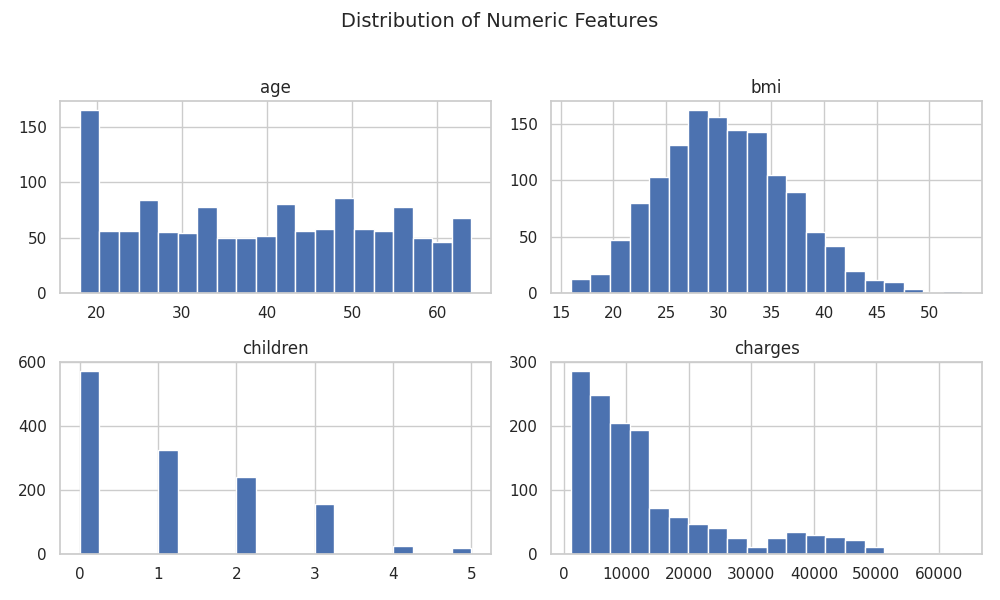
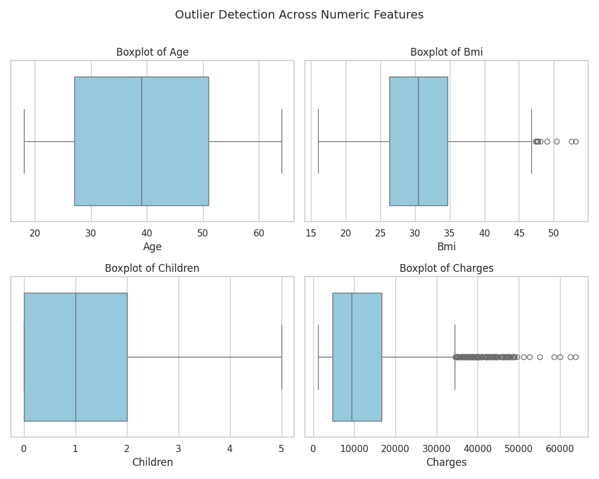
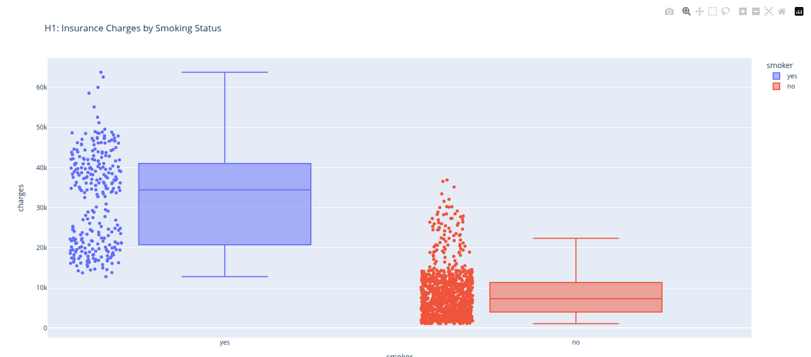
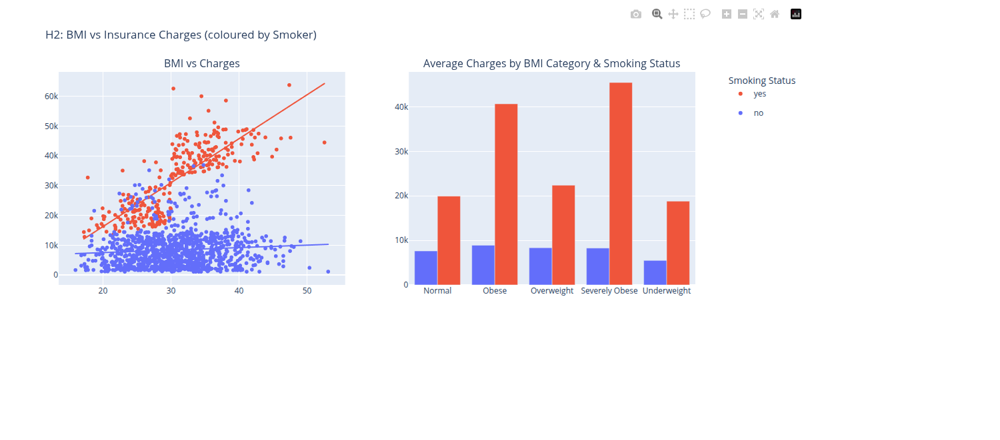

# 🏥 Healthcare Insurance Cost Analysis

Individual Formative Project – Code Institute Data Analytics with AI Bootcamp

| | |
|--------|---------------------|
|Author: |Robert Steven Elliott|
|Date:   | October 2025        |

## Table of Contents

1. [Project Overview](#project-overview)
2. [Dataset Content](#dataset-content)
3. [Business Requirements](#business-requirements)
4. [Prioject Plan](#project-plan)
5. [Rationale](#rationale-mapping-business-requirements-to-data-visualisations)
6. [Analysis Techniques](#analysis-techniques-used)
7. [Ethical Considerations](#ethical-considerations)
8. [Unfixed Bugs](#unfixed-bugs)
9. [Development Roadmap](#development-roadmap)
10. [Findings and Conclusion](#findings-and-conclusion)
11. [Libraries](#main-data-analysis-libraries)
12. [Installation](#installation)
13. [Credits](#credits)
14. [Acknowledgements](#acknowledgements-optional)

## Project Overview

Healthcare Insurance Cost Analysis explores a dataset from Kaggle to understand how personal and geographic attributes influence medical insurance charges.

The project applies data extraction, transformation, and loading (ETL) techniques, followed by exploratory data analysis (EDA) and visualisation, to reveal trends in healthcare costs based on age, BMI, smoking habits, family size, and region.

This project was completed as part of the Code Institute Data Analytics with AI Bootcamp and meets all criteria for the Individual Formative Assignment.

## Dataset Content

### Data Source

The dataset contains 1,338 records with the following fields:

| Feature   | Description |
|-----------|-------------|
| age       | Age of the primary beneficiary |
| sex       | Gender (male/female)           |
| bmi       | Body Mass Index (measure of body fat based on height and weight) |
| children  | Number of dependents covered by insurance |
| smoker    | Smoking status (yes/no) |
| region    | Residential area in the U.S. (northeast, northwest, southeast, southwest) |
| charges   | Final insurance cost billed by the company |

### Initial Observations

- No missing values but potential outliers in bmi and charges.
- Categorical data (sex, smoker, region) will require encoding.
- Likely non-linear relationships between variables (especially smoker and charges).

## Business Requirements

### Business Understanding

Healthcare costs vary significantly based on individual lifestyle and demographic factors.
Understanding these variations helps:

- Insurers better estimate risk and set fairer premiums.
- Policymakers identify factors contributing to high medical costs.
- Individuals understand how habits (e.g., smoking or high BMI) may affect their healthcare expenses.

#### Key Questions

1. Which personal attributes have the strongest impact on healthcare costs?
2. How do regional factors influence insurance charges?
3. What data-driven insights can help explain cost variability among individuals?

### Initial Hypotheses

Before conducting the analysis, the following hypotheses were proposed based on domain knowledge and expectations about healthcare insurance costs:

1. **H1: Smoking status significantly increases insurance charges.**\
Smokers are expected to pay considerably higher premiums due to elevated health risks.
2. **H2: Higher BMI correlates with higher insurance charges.**\
Individuals with obesity or high BMI values are likely to face greater healthcare costs due to increased medical risk factors.
3. **H3: Age positively correlates with insurance charges.**\
Older individuals typically incur higher medical expenses, resulting in higher insurance premiums.
4. **H4: Gender has little or no significant effect on insurance charges.**
Gender differences are expected to have minimal impact after controlling for smoking and BMI.
5. **H5: Geographic region may influence charges slightly, but lifestyle factors (e.g., smoking, BMI) will have a stronger effect.**\
Regional variations might reflect cost-of-living or healthcare access differences, but are not expected to be the dominant factor.
6. **H6: Individuals with more children (dependents) may experience slightly higher insurance costs.**\
Larger families may increase policy coverage, though the individual impact may be modest.

#### Purpose

These hypotheses guide the Exploratory Data Analysis (EDA) phase, ensuring that each visualisation and statistical test helps confirm or challenge these assumptions.

## Project Plan

### Project Management

- Template Used: Code Institute Data Analytics Template
- Methodology: Agile
- Tool: GitHub Projects (Kanban Board)

#### Workflow

| Stage | Description |
|-------|-------------|
| Ideation | Defined project objectives and research questions |
| Project Setup | Created Repository and User Stores |
| ETL Implementation | Cleaned and validated the dataset |
| Visualisation | Developed static and interactive visuals |
| Documentation | Complete README |

### Technologies Used

- Languages: Python (Jupyter Notebook)
- Libraries: pandas, numpy, matplotlib, seaborn, plotly
- Version Control: Git & GitHub
- Project Management: GitHub Projects
- Data Source: Kaggle

## Rationale: Mapping Business Requirements to Data Visualisations

| Hypothesis / Business Question       | Chosen Visualisation              | Purpose / Rationale                                                                                                         |
| ------------------------------------ | --------------------------------- | --------------------------------------------------------------------------------------------------------------------------- |
| H1: Smoking status impact on charges | Box plot or violin plot           | Visualises the distribution of charges for smokers vs. non-smokers, highlighting differences and supporting the hypothesis. |
| H2: BMI vs insurance charges         | Scatter plot with regression line | Shows the correlation between BMI and charges, helping to detect trends and outliers.                                       |
| H3: Age vs insurance charges         | Scatter plot or line plot         | Displays the relationship between age and charges to see if costs rise with age.                                            |
| H4: Gender differences               | Box plot or bar chart             | Compares charges between male and female groups to identify any significant differences.                                    |
| H5: Regional influence on charges    | Bar chart or box plot by region   | Examines how average or distribution of charges varies by region, highlighting potential geographic effects.                |
| H6: Number of children vs charges    | Box plot or scatter plot          | Visualises whether individuals with more dependents have higher insurance costs.                                            |
| Overall attribute impact             | Pair plots or correlation heatmap | Provides a broad view of relationships among multiple variables to identify which attributes most influence charges.        |

## Analysis techniques used

- Descriptive Statistics: Calculated summary measures for numeric and categorical variables to understand distributions, central tendencies, and variability.
- Exploratory Data Visualisation: Created interactive plots (scatter plots, box plots, bar charts, and trendlines) to examine relationships between personal attributes (e.g., age, BMI, smoking status) and healthcare charges.
- Correlation Analysis: Analysed the strength and direction of relationships between numeric features using a heatmap to identify factors most impacting insurance costs.
- Pairwise Analysis: Examined interactions between multiple variables simultaneously with scatter matrices to detect multivariate patterns.
- Hypothesis-Driven Exploration: Each visualisation was aligned with a business hypothesis (e.g., impact of smoking, BMI, age, gender, region, number of children) to provide actionable insights.

## Ethical considerations

This project uses a publicly available Kaggle dataset containing insurance data, including age, sex, BMI, smoking status, and insurance charges. All analyses ensure individual privacy, with no personally identifiable information exposed. Potential biases in variables such as smoker status, sex, and BMI are acknowledged, and correlations are interpreted responsibly, without implying causation. Analytical steps are documented for transparency and reproducibility, and users are cautioned against applying the findings in ways that could lead to unfair discrimination or privacy breaches.

## Unfixed Bugs

- Code for generating subplots could be neater and in it's own function
- The libraries required by Code Institute are old, i have had to silence FutureWarnings to account for this.

## Development Roadmap

The project began with acquiring and cleaning the Kaggle insurance dataset, ensuring data quality and consistency. Exploratory data analysis was conducted to uncover patterns and relationships between variables such as age, BMI, smoking status, and insurance charges. Features were engineered, including categorisation of continuous variables, to enhance insights and support hypothesis testing. The analysis was visualised through clear and interpretable plots, highlighting key trends and correlations. Future improvements could include updating the code to use the latest Python and library versions, exploring predictive models, and developing interactive dashboards for more dynamic insights.

## Findings and Conclusion

### Dataset Investigation & Initial Analysis

Before the main analysis, the dataset was explored to ensure quality and understand variable distributions.

- Data Overview: Checked the number of rows, columns, data types, and basic statistics.
- Missing Values & Anomalies: No missing values; outliers and inconsistencies were identified and handled.
- Feature Understanding: Continuous variables like BMI and age were categorised; categorical variables like smoker status, sex, and number of children were reviewed.

#### Key Distributions

##### Numerical

Histograms and boxplots were used to examine key variables:





- BMI mostly falls within a healthy to overweight range.
- Charges are positively skewed, reflecting higher costs for certain groups.

##### Categorical

Boxplots and grouped averages explored categorical variables:

[View Interactive Plot (ctrl click to open in new tab)](https://rse1982.github.io/health-insurance-cost-analysis/figures/categorical_feature_distributions.html)

##### Correlations & Relationships

Correlation matrices and scatter plots revealed relationships between numerical variables and charges:


- Charges are strongly correlated with Smoking, BMI and age.


- Smoking has the highest correlation with charges.
- With gender and children have the least correlation.

## Hypotheses Evaluation

The following hypotheses were tested. Each includes a static plot and a link to the interactive version:

### H1: Smoking status significantly increases insurance charges

Smokers consistently show higher charges across all age and BMI groups.


[View Interactive Plot (ctrl click to open in new tab)](https://rse1982.github.io/health-insurance-cost-analysis/figures/charges_by_smoking_status.html)

### H2: Higher BMI correlates with higher insurance charges


[View Interactive Plot (ctrl click to open in new tab)](https://rse1982.github.io/health-insurance-cost-analysis/figures/bmi_analysis_combined.html)

### H3: Age positively correlates with insurance charges


[View Interactive Plot (ctrl click to open in new tab)](https://rse1982.github.io/health-insurance-cost-analysis/figures/age_analysis_combined.html)

### H4: Gender has little or no significant effect on insurance charges


## Main Data Analysis Libraries

| Library        | Usage                                          |
| -------------- | ---------------------------------------------- |
| **pandas**     | Data manipulation and cleaning                 |
| **numpy**      | Numerical computations                         |
| **matplotlib** | Basic static visualisations                    |
| **seaborn**    | Advanced visual styling and statistical plots  |
| **plotly**     | Optional interactive charts                    |
| **jupyter**    | Notebook environment for step-by-step analysis |

## Installation

### 1. Clone this repository:

```[bash]
git clone https://github.com/RSE1982/health-insurance-cost-analysis
cd healthcare-insurance-cost-analysis
```

### 2. Create Virtual Environment:

```[bash]
python -m venv .venv
```

### 3. Install Dependencies:

```[bash]
pip install -r requirements.txt
```

## Credits

### Content

- Kaggle Dataset: “Insurance Charges Dataset” ([link](https://www.kaggle.com/datasets/willianoliveiragibin/healthcare-insurance))
- Python libraries used for analysis and visualisation: pandas, numpy, plotly, seaborn, matplotlib
- Guidance and code suggestions provided by ChatGPT (OpenAI)
- Tutorials and documentation consulted for analysis methods and data handling

### Media

- All charts, plots, and figures were created by the project author using Python libraries.
- No external images or media were used.

## Acknowledgements (optional)
